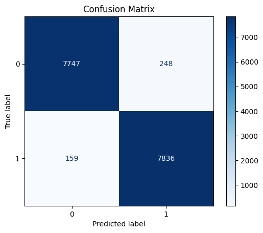

# AI Image Detection: Advanced Machine Learning (STAT362) Final Project
Paris Bozzuti, Ronaldo Tineo and Akshay Anand

## Introduction
- For our final project for STAT362, Advanced Machine Learning, we are creating a well-tuned CNN model to identify images as either AI-generated or Human-Generated. 
- Data from Kaggle, AI vs. Human-Generated Images: https://www.kaggle.com/datasets/alessandrasala79/ai-vs-human-generated-dataset/data?select=train_data
**Slideshow**: https://docs.google.com/presentation/d/1Y8nkwvKvoGd61yh6AWf12W5cn-Dh4p607nVUfds2TP8/edit?usp=sharing

In recent years, AI image generation systems have become increasingly capable of creating images that are hard to distinguish from real images. As these algorithms are inevitably further developed and strengthened, it will become even more difficult to differentiate human-generated images from AI-generated ones, which is critical for things such as news verification, academic integrity, and preventing online misinformation. The goal of our project is to build a deep learning model capable of identifying whether an image is real or generated by an AI model. This project has real world implications for the purposes of media trust and moderation of online platforms. 

We will be using the AI vs. Human-Generated Images dataset from Kaggle. The dataset contains about 80,000 images, including pairs where one image is a real photograph from Shutterstock and its counterpart is an AI recreation. About ⅓ of the dataset includes images of human people, which makes it more complex as it is harder to identify images of human people as AI generated. This dataset is licensed for public use, making it appropriate for us to use it within a shared GitHub repository. In terms of our approach, we will start with a baseline model, and work from there to improve classification accuracy. Each of us will explore variations of the model, including callback settings, regularization, initialization, and optimization. We will test each model’s performance and select the final model that provides us with the highest accuracy. We will also explore transfer learning with pre-trained models and identify what best picks up on the visual cues of an AI-generated or human image. 

## Base Model
Our baseline model was a standard CNN built with Keras for binary classification. It has 3 convolutional blocks: each with a Conv2D layer (32 filters → 64 →128) and a MaxPooling2D layer. The fully connected layers include a flattening layer and 2 Dense layers with a sigmoid output. 

Our other models use the MobileNetV2 architecture with a custom classifier, Adam Optimizer, L2 Regularization, Batch Normalization and Dropout. 

## Key Results

Our current highest performing model is located in the code folder: **mobile_net_3.ipynb** with a validation accuracy of **0.9745.**

This is a MobileNetV2 model with fine tuning and pre-processing included. 
**Base Model**: MobileNetV2: pre-trained on ImageNet
**Custom Classifier**: GlobalAveragePooling2D, Dense(128) with L2 Regularization, Batch Normalization, Dropout(0.5), Dense(1, sigmoid)
Adam Optimizer, 1e-5 LR
- 10 Epochs, ~ 1 hr to run on GPU

## How to Run

Each model .ipynb file can be run from top to bottom, with htmls included of current results. These can be run on a consumer computer with GPU. Each file can be run as is. Each model takes about an hour on GPU to train. 
